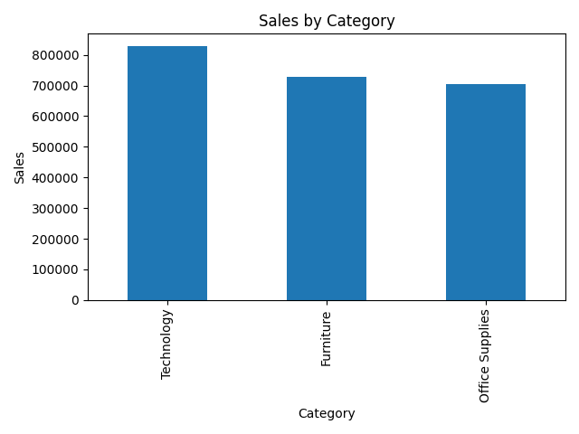
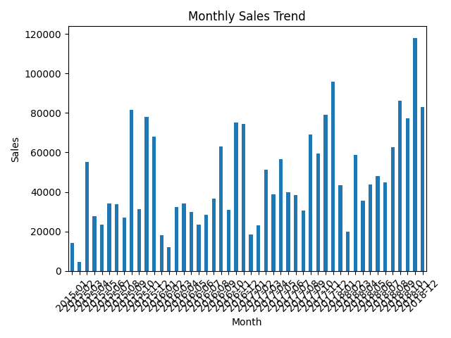

# 🛍️ RetailSight: Retail Sales Analytics

## 📌 Problem Statement

Retail businesses generate large amounts of sales data but often struggle to extract meaningful insights. This project analyzes retail data to uncover trends and improve decision-making.

---

## 🎯 Objective

* Analyze sales performance
* Identify top categories and regions
* Understand customer behavior
* Generate business insights

---

## 📂 Dataset

* Source: Kaggle (Superstore dataset)
* Contains sales, category, region, and customer data

---

## ⚙️ Approach

* Data Cleaning
* Exploratory Data Analysis (EDA)
* Feature Engineering
* Visualization

---

## 📊 Visualizations

### Sales by Category



### Monthly Sales Trend



---

## 💡 Key Insights

* Technology category generates highest sales
* Certain regions dominate revenue
* Sales show seasonal trends
* Top products contribute major share

---

## 🛠️ Tech Stack

* Python
* Pandas
* Matplotlib

---

## 📁 Project Structure

```
retailsight/
│── analysis.py
│── train.csv
│── visuals/
│    ├── category_sales.png
│    ├── monthly_sales.png
│── README.md
```

---

## 🚀 Future Improvements

* Build interactive dashboard using Streamlit
* Add sales forecasting
* Improve visualization

---

## 👤 Author

**Shwetha Francis**
AI & Data Science Graduate
